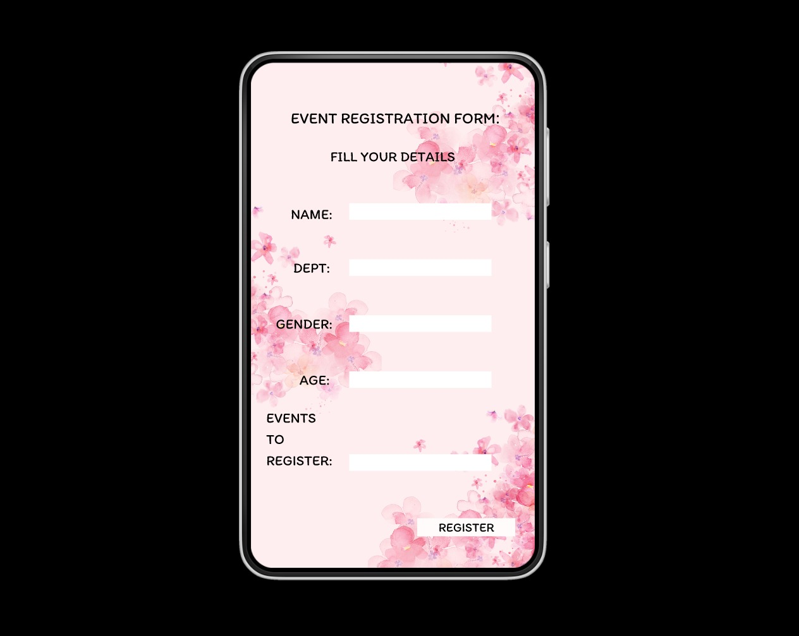
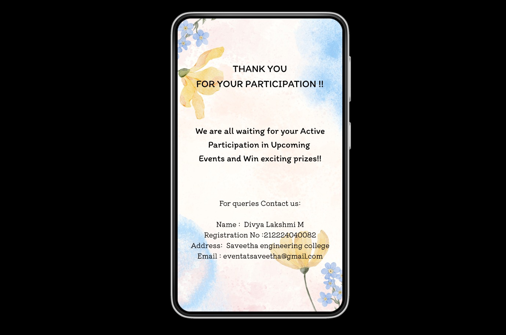

# Ex09 Event Registration Web Application
## Date: 20.05.2025

## AIM:
To design, develop and deploy a web application for event registration.

## DESIGN STEPS:

### Step 1:
Create a new frame.

### Step 2:
Select any one preset size of your choice.

### Step 3:
Select the shapes you need.

### Step 4:
Import images as needed.

### Step 5:
Create pages based on your need and link them.

### Step 6:

Validate the HTML and CSS code.

### Step 6:

Publish the website in the given URL.

## DESIGN TOOL:
Figma

## CODE:
```
Page1.html

<!DOCTYPE html>
<html lang="en">
<head>
  <meta charset="UTF-8">
  <meta name="viewport" content="width=device-width, initial-scale=1.0">
  <title>Sports Day Events</title>
  <link rel="stylesheet" href="styles.css">
</head>
<body>
  <div class="container">
    <div class="header">
      
    </div>

    <div class="logo">
      
    </div>

    <h2 class="title">SPORTS DAY EVENTS</h2>

    <div class="buttons">
      <button class="btn">LOGIN</button>
      <button class="btn">REGISTER</button>
    </div>
  </div>
</body>
</html>

Styles.css

* {
  margin: 0;
  padding: 0;
  box-sizing: border-box;
  font-family: Arial, sans-serif;
}

body {
  background: url('background.jpg') no-repeat center center fixed;
  background-size: cover;
  height: 100vh;
  display: flex;
  align-items: center;
  justify-content: center;
}

.container {
  width: 320px;
  background: rgba(255, 255, 255, 0.85);
  border-radius: 20px;
  padding: 20px;
  text-align: center;
  box-shadow: 0 0 15px rgba(0,0,0,0.2);
}

.header-img {
  width: 100%;
  border-radius: 10px;
  margin-bottom: 20px;
}

.logo img {
  width: 140px;
  height: auto;
  margin-bottom: 10px;
}

.title {
  color: red;
  font-weight: bold;
  margin-bottom: 30px;
}

.buttons {
  display: flex;
  flex-direction: column;
  gap: 15px;
}

.btn {
  background-color: #d3cfcf;
  border: none;
  padding: 12px;
  font-size: 16px;
  border-radius: 5px;
  cursor: pointer;
  font-weight: bold;
}

.btn:hover {
  background-color: #bfbaba;
}

Page2.html

<!DOCTYPE html>
<html lang="en">
<head>
  <meta charset="UTF-8">
  <meta name="viewport" content="width=device-width, initial-scale=1">
  <title>Sports Events</title>
  <link rel="stylesheet" href="events.css">
</head>
<body>
  <div class="container">
    <div class="background-elements"></div>
    
    <h1>SPORTS DAY EVENTS :</h1>
    <ul>
      <li>CRICKET</li>
      <li>FOOTBALL</li>
      <li>VOLLEY BALL</li>
      <li>BASKET BALL</li>
      <li>KHO - KHO</li>
    </ul>
    
    
    
  </div>
</body>
</html>

Styles.css

* {
  margin: 0;
  padding: 0;
  box-sizing: border-box;
  font-family: 'Segoe UI', Tahoma, Geneva, Verdana, sans-serif;
}

body {
  background: #000;
  display: flex;
  justify-content: center;
  align-items: center;
  height: 100vh;
}

.container {
  position: relative;
  width: 320px;
  height: 600px;
  background-color: #fffdf7;
  border-radius: 25px;
  padding: 30px 20px;
  text-align: left;
  box-shadow: 0 0 15px rgba(0, 0, 0, 0.3);
  overflow: hidden;
}

.background-elements::before,
.background-elements::after {
  content: '';
  position: absolute;
  border-radius: 50%;
  background-color: #eaeaea;
  z-index: 0;
}

.background-elements::before {
  width: 100px;
  height: 100px;
  top: 20px;
  right: 20px;
}

.background-elements::after {
  width: 80px;
  height: 80px;
  bottom: 100px;
  left: 30px;
}

h1 {
  font-size: 20px;
  font-weight: 600;
  text-align: center;
  margin-bottom: 20px;
  text-shadow: 1px 1px 1px #aaa;
  z-index: 1;
  position: relative;
}

ul {
  list-style-type: disc;
  padding-left: 30px;
  z-index: 1;
  position: relative;
}

ul li {
  font-size: 16px;
  font-weight: 500;
  margin-bottom: 10px;
}

.player-img {
  position: absolute;
  bottom: 0;
  left: 0;
  width: 160px;
  z-index: 1;
}

.ball-img {
  position: absolute;
  bottom: 20px;
  right: 30px;
  width: 40px;
  z-index: 1;
}

Register.html

<!DOCTYPE html>
<html lang="en">
<head>
  <meta charset="UTF-8">
  <meta name="viewport" content="width=device-width, initial-scale=1">
  <title>Event Registration</title>
  <link rel="stylesheet" href="register.css">
</head>
<body>
  <div class="form-container">
    <h2>EVENT REGISTRATION FORM:</h2>
    <p>FILL YOUR DETAILS</p>

    <form>
      <label for="name">NAME:</label>
      <input type="text" id="name" name="name" required>

      <label for="dept">DEPT:</label>
      <input type="text" id="dept" name="dept" required>

      <label for="gender">GENDER:</label>
      <input type="text" id="gender" name="gender" required>

      <label for="age">AGE:</label>
      <input type="number" id="age" name="age" required>

      <label for="event">EVENTS TO REGISTER:</label>
      <input type="text" id="event" name="event" required>

      <button type="submit">REGISTER</button>
    </form>
  </div>
</body>
</html>

Styles.css

body {
  margin: 0;
  padding: 0;
  background-color: #000;
  font-family: 'Segoe UI', sans-serif;
  display: flex;
  justify-content: center;
  align-items: center;
  height: 100vh;
}

.form-container {
  background: url('register.jpg') no-repeat center center;
  background-size: cover;
  width: 320px;
  height: 600px;
  padding: 40px 20px;
  border-radius: 25px;
  box-shadow: 0 0 15px rgba(0, 0, 0, 0.3);
  color: #000;
  text-align: left;
  box-sizing: border-box;
}

h2 {
  text-align: center;
  font-size: 18px;
  margin-bottom: 10px;
}

p {
  text-align: center;
  font-size: 14px;
  margin-bottom: 20px;
}

form {
  display: flex;
  flex-direction: column;
}

label {
  margin: 5px 0 2px;
  font-weight: 500;
  font-size: 14px;
}

input {
  padding: 6px;
  margin-bottom: 10px;
  border: none;
  border-radius: 4px;
  width: 100%;
  box-sizing: border-box;
}

button {
  margin-top: 10px;
  padding: 8px;
  background-color: white;
  border: none;
  font-weight: bold;
  border-radius: 4px;
  cursor: pointer;
}

Thank.html

<!DOCTYPE html>
<html lang="en">
<head>
  <meta charset="UTF-8">
  <meta name="viewport" content="width=device-width, initial-scale=1">
  <title>Thank You</title>
  <link rel="stylesheet" href="thankyou.css">
</head>
<body>
  <div class="thankyou-container">
    <h2>THANK YOU<br>FOR YOUR PARTICIPATION !!</h2>
    
    <p class="message">
      We are all waiting for your Active<br>
      Participation in Upcoming<br>
      Events and Win exciting prizes!!
    </p>

    <p class="contact-header">For queries Contact us:</p>

    <div class="contact-info">
      <p><strong>Name:</strong> Divya Lakshmi M</p>
      <p><strong>Registration No:</strong> 212224040082</p>
      <p><strong>Address:</strong> Saveetha engineering college</p>
      <p><strong>Email:</strong> eventats

Styles.css

body {
  margin: 0;
  padding: 0;
  background-color: #000;
  font-family: 'Segoe UI', sans-serif;
  display: flex;
  justify-content: center;
  align-items: center;
  height: 100vh;
}

.thankyou-container {
  background: url('thank.jpg') no-repeat center center;
  background-size: cover;
  width: 320px;
  height: 600px;
  padding: 30px 20px;
  border-radius: 25px;
  box-shadow: 0 0 15px rgba(0, 0, 0, 0.3);
  color: #000;
  text-align: center;
  box-sizing: border-box;
}

h2 {
  font-size: 18px;
  margin-bottom: 20px;
}

.message {
  font-size: 15px;
  margin-bottom: 30px;
}

.contact-header {
  font-size: 14px;
  margin-bottom: 10px;
}

.contact-info {
  text-align: left;
  font-size: 14px;
  line-height: 1.5;
}

```

## OUTPUT:





## RESULT:
The program to design, develop and deploy a web application for event registration is completed successfully.
